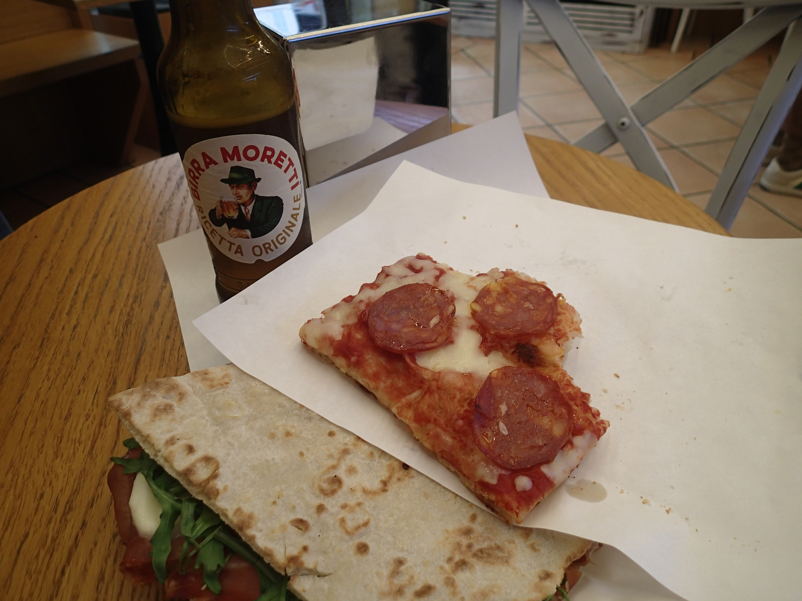

Reggel megtartottam a szakkört, reggeliztem és 15 körül elindultam Assisibe, ami a szállástól kb 20 kilométerre volt. 
Assisi egy középkori kisváros egy domb tetején, tele régi épületekkel és sikátorokkal. Még a város peremén leraktam a biciklimet és sétálva folytattam. 
Először egy étteremben álltam meg ahol kenyérlángoshoz hasonló szalámis pizzát ettem, és egy sonkás-mozzarellás-rukkolás szendvicset.  Az étterem után elsétáltam a Szent Ferenc Bazilikához, ami a város túloldalán volt. Gyönyörű épület, óriási festett boltívekkel.  Nagyon sok látnivaló volt egymás hegyén hátán. Még arra emlékszem, hogy meg néztem Szent Ferenc sírját is. Hazafelé kilyukadt a kerekem és egy ideig tolni kellett a biciklimet, mert a pumpát a szálláson hagytam. Szerencsére találtam egy benzinkutat, ott megjavítottam a kereket és felpumpáltam.
